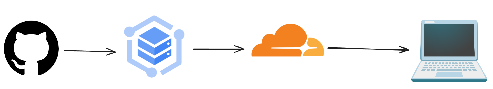

# La mejor estrategia para desarrollar con Kubernetes

Como desarrolladores siempre nos tenemos que encontrar con la tarea de desplegar nuestras aplicaciones en algún entorno, ya sea dentro de una MVs, Clusters orquestados con Kubernetes, servicios serverless entre otros.

Bueno spoiler pero hoy hablaremos de como trabajar con Kubernetes, este es una herramienta orquestadora, quiere decir que se encargara de disponer y escalar nuestra aplicación, e lo que reconoce como Nodos que para fines prácticos pueden ser maquinas virtuales o servidores, lo importante es que esta herramienta nos permite desplegar infraestructura como código o en otras palabras describir como se despliega nuestra aplicación, como debe escalar, como debe exponerse y como debe ejecutarse.

## El infierno de Kubernetes

Por hoy Kubernetes es mi herramienta favorita si se trata de desplegar una aplicación en internet, ya que siempre me permite desplegar mi aplicación de una manera muy rápida y concisa (cuando se sabe como) y por hoy uso GKE de GCP para desplegar todas mis aplicaciones, y para exponer a internet lo hago mediante Cloudflare. Esto se vería algo asi.

Donde mi código se guarda en github, lo despliego en un pod de Kubernetes y lo expongo mediante Cloudflare a internet. 

y entonces ¿por que hablo del *infierno de Kubernetes 😈*? por una simple razón, como desarrollador me gusta que mi código funciona siempre tan solo cambiando las variables de ambientes. Pero cuando se trata de trabajar con formulas de Kubernetes parece que cada formula funciona solo para una ocasión. Incluso he visto algunos casos donde no se puede rehusar nisiquiera el deployment por que tiene configuraciones finas del cluster en donde esta alojado. Esto lo hace una pesadilla sobre todo cuando queremos rehusar, migrar o simplemente mantener dar mantenimiento al cluster. 

¿Es problema de Kubernetes estos problemas? No, Kubernetes cumple con su objetivo y es orquestar cargas de trabajo, pero como puede estar en mucha infraestructuras distintas no podemos evitar pensar en ellas cuando estamos creando nuestras formulas. En este articulo en especifico vamos a entender como usar Kubernetes desde local hasta producción.

## No mas buildpack

Si ya estamos entrando al mundo cloud con herramientas orquestadoras, contenedores, etc. debemos parar de pensar en nuestra aplicaciones como un conjunto de pasos de código a servicio desplegado. Ojo, no quiero decir que no debamos esperar de una aplicación no se pueda desplegar mediante el push en un repositorio.

debemos entender que existen 2 grandes proceso clave. por una parte la compilación de nuestro código y por otro el despliegue de nuestros artefactos.

