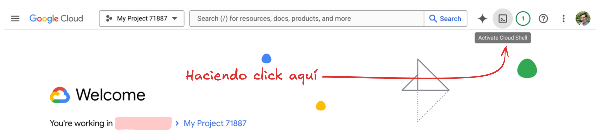
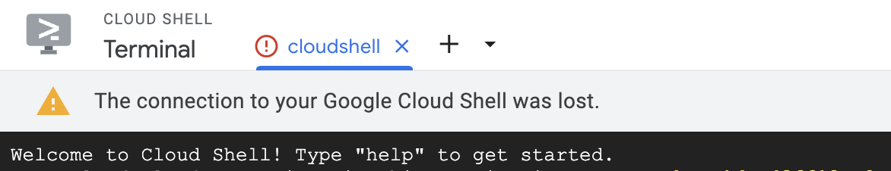
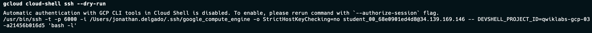
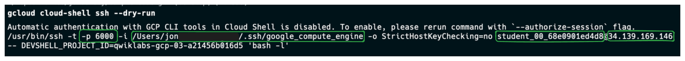
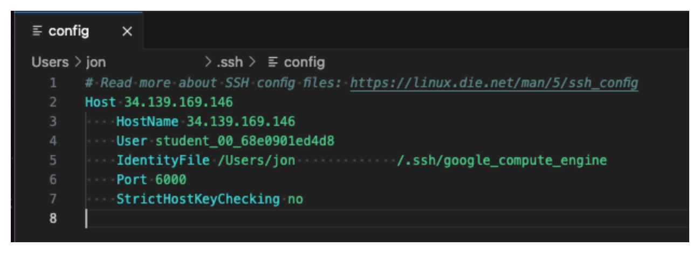
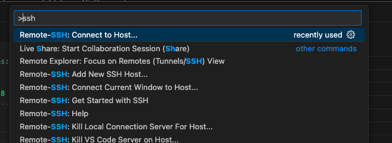
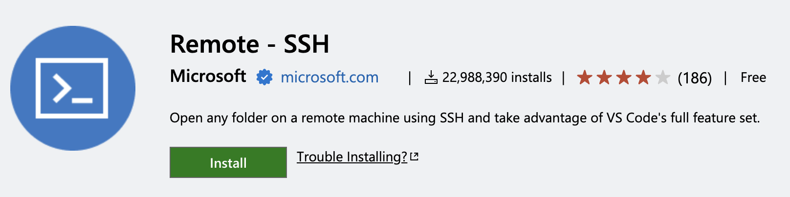
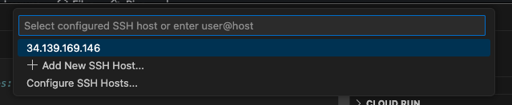
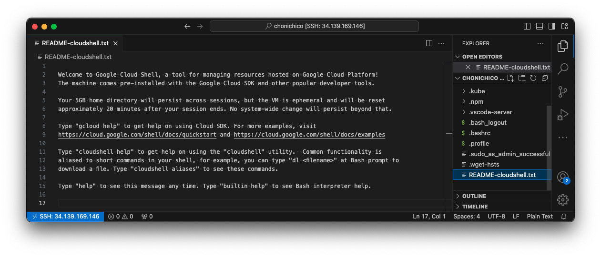

# Como conectarse a Google Cloud Shell desde Visual Studio Code

GCP es la cloud de Google y con esta tenemos una herramienta muy poderosa la cual es la **cloud-shell** esta herramienta es una maquina virtual que podemos acceder directamente desde la consola de GCP.

Sin embargo, dependiendo de la conexión o configuración, puedes experimentar problemas al usar esta herramienta desde la web.

Si normalmente te pasa este problema una vez no hay problema solo ejecuta nuevamente la consola web y ya esta, pero si se repite podemos conectarnos por SSH usando visual estudio code. La siguiente guía te explico en pocos pasos como hacerlo rápidamente.

## 1. Obtener configuraciones SSH

> Para este paso debes estar logeado desde tu consola. Leer el siguiente guía (gcloud auth login)[https://cloud.google.com/sdk/gcloud/reference/auth/login]

En tu terminal ejecuta el siguiente comando `gcloud cloud-shell ssh --dry-run` este comando nos entregara toda la linea de comando SSH para conectarnos desde la terminal, estas configuraciones los usaremos para conectarnos desde nuestro editor.

de esta linea de comando para conectarse a SSH vamos a tener que recuperar el *Host*, *Usuario*, *archivo de identificación* y el *Puerto*.

De la salida mostrada podemos recuperar los siguientes valores

- Host: `34.139.169.146`
- Usuario: `student_00_68e0901ed4d8`
- Archivo de identificación: `/Users/jon             /.ssh/google_compute_engine`
- Puerto: `6000`

## 2. Configurar perfil SSH

Ya con los valores recuperados, vamos a configurar nuestro archivo `~/ssh/config` este archivo se encarga de configurar todos nuestras configuraciones para conectarnos a nuestra terminal cloud-shell por SSH.

Este archivo debe verse algo similar a:

## 3. Conectarnos desde Visual Studio Code

Por último, abre la terminal de comandos en Visual Studio Code y escribe `connect to host`.

> Si esta opción no aparece puedes intentar instalar la extension [Remote - SSH](https://marketplace.visualstudio.com/items?itemName=ms-vscode-remote.remote-ssh)
> 

Luego seleccionar el host de nuestra cloud-shell.

Y Listo 🚀

Ya estaríamos conectados a la cloud-shell sin problemas

## Conclusion

Si necesitamos conectarnos a cloud-shell desde la consola web, adelante es muy potente y una muy buena opción para trabajar con los recursos de GCP rápidamente, sin embargo ya sea por comodidad por por latencia en la consola, podemos acceder a ella mediante la terminal SSH. Esta opción es ideal si estas quieres mantener un entorno agradable, mover archivos rápidamente entre tu equipo y Cloud Shell o simplemente quieres conectarte a resolver algún lab sin guardar muchos archivos en tu equipo local.

