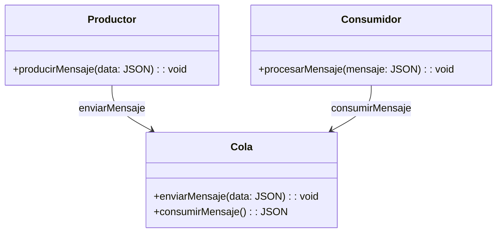
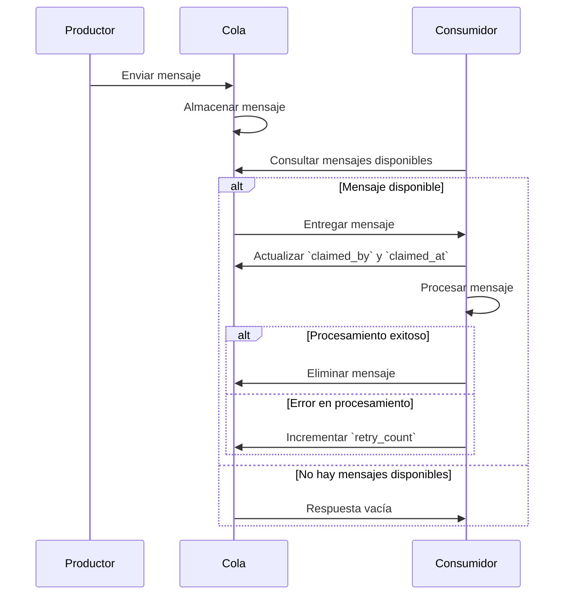

# Crear tu propio sistema de colas

<!-- badges -->

[](https://github.com/JonDotsoy/jondotsoy/issues/new?title=article:custom-queue:+&labels=question)

<!-- /badges -->

<!-- Introducción -->

¿Te has preguntado cómo las grandes aplicaciones logran mantenerse estables cuando miles de usuarios intentan realizar acciones al mismo tiempo? La respuesta, en muchos casos, está en los sistemas de colas. Una cola es como una fila virtual donde los mensajes o tareas esperan su turno para ser procesados. Esto permite que los diferentes componentes de una aplicación trabajen de manera coordinada, sin interferencias ni sobrecargas. Las colas son esenciales para lograr escalabilidad, tolerancia a fallos y un flujo de trabajo ordenado. Si tu aplicación utiliza microservicios, eventos o maneja un alto volumen de usuarios, es probable que ya estés usando (o deberías considerar usar) un sistema de colas. Ejemplos populares incluyen Apache Kafka, RabbitMQ, Amazon SQS y Google Pub/Sub. Todos ellos comparten un objetivo común: garantizar que los mensajes no se pierdan y que el sistema funcione de manera fluida.

En este artículo, aprenderás cómo construir tu propio sistema de colas desde cero. Exploraremos los conceptos fundamentales, su utilidad práctica y cómo puedes adaptarlos a las necesidades específicas de tu proyecto, sin complicaciones.

Crear tu propio sistema de colas te brinda una solución robusta para abordar desafíos relacionados con la persistencia, el mantenimiento y la escalabilidad. Al tener control total sobre el diseño e implementación, puedes personalizar el sistema para que se ajuste perfectamente a los requisitos de tu aplicación. Por ejemplo, estrategias como dividir las bases de datos según el hash del identificador del mensaje permiten distribuir la carga de manera eficiente, evitando cuellos de botella y mejorando el rendimiento. Además, este enfoque personalizado facilita la incorporación de nuevas funcionalidades a medida que tu sistema evoluciona, asegurando que sea flexible y capaz de adaptarse al crecimiento de tu negocio.

<!-- TOC -->

**Tabla de Contenidos**

1. [¿Qué es una cola y cómo funciona?](#qué-es-una-cola-y-cómo-funciona)
2. [Funcionalidades clave de una cola](#funcionalidades-clave-de-una-cola)
   - [Importancia de gestionar el tiempo de vida de los mensajes](#importancia-de-gestionar-el-tiempo-de-vida-de-los-mensajes)
   - [Control sobre los reintentos](#control-sobre-los-reintentos)
3. [¿Qué es un consumidor?](#qué-es-un-consumidor)
4. [Diseñando nuestro sistema](#diseñando-nuestro-sistema)
   - [Reclamación de mensajes: propiedades `claimed_at` y `claimed_by`](#reclamación-de-mensajes-propiedades-claimed_at-y-claimed_by)
     - [Proceso de reclamación de mensajes](#proceso-de-reclamación-de-mensajes)
     - [Asignación de mensajes](#asignación-de-mensajes)
     - [Beneficios del mecanismo de reclamación](#beneficios-del-mecanismo-de-reclamación)
5. [Ejemplo práctico con SQLite](#ejemplo-práctico-con-sqlite)
   - [1. Creación de la base de datos y el esquema](#1-creación-de-la-base-de-datos-y-el-esquema)
   - [2. Insertar mensajes en la cola](#2-insertar-mensajes-en-la-cola)
   - [3. Reclamar y consultar mensajes](#3-reclamar-y-consultar-mensajes)
   - [4. Eliminar mensajes procesados](#4-eliminar-mensajes-procesados)
   - [5. Ejemplo completo: Clase QueueOnSQLite](#5-ejemplo-completo-clase-queueonsqlite)
6. [Conclusión y agradecimientos](#conclusión-y-agradecimientos)

<!-- /TOC -->

## ¿Qué es una cola y cómo funciona?

Imagina una fila en la panadería: el primero que llega es el primero que se atiende. Así funcionan las colas en tecnología (sí, también se llaman FIFO: First-In, First-Out). Una cola es básicamente un lugar donde dejas mensajes o tareas para que alguien más los recoja y los procese después. Sirve para que los sistemas no se saturen y para que cada cosa se haga en su momento, sin apuros ni pérdidas.

## Funcionalidades clave de una cola

- **Crear un registro o mensaje:** Los productores (o sea, los que generan trabajo) mandan mensajes a la cola. Cada mensaje es una tarea pendiente.
- **Consumir mensajes:** Los consumidores son los que revisan la cola y se encargan de procesar esos mensajes. Puede ser un servicio, un script, o cualquier cosa que lea y haga lo que hay que hacer.



### Importancia de gestionar el tiempo de vida de los mensajes

El tiempo de vida de un mensaje es crucial para evitar que el sistema se sature con tareas obsoletas o irrelevantes. Al establecer una fecha de expiración (`expiration_at`), garantizamos que los mensajes que ya no son útiles sean descartados automáticamente, liberando recursos y permitiendo que el sistema se enfoque en las tareas que realmente importan. Esto es especialmente importante en sistemas donde los datos o las tareas tienen una validez limitada, como notificaciones o eventos temporales.

### Control sobre los reintentos

Tener un control claro sobre los reintentos es esencial para manejar errores de manera eficiente y evitar ciclos infinitos de procesamiento. La propiedad `retry_count` nos permite limitar el número de intentos para procesar un mensaje, lo que ayuda a identificar problemas persistentes y a tomar decisiones informadas, como enviar alertas o mover el mensaje a una cola de errores. Este enfoque asegura que el sistema sea resiliente y que los errores no afecten el rendimiento general.

## ¿Qué es un consumidor?

<!-- Aclaracion de lo que es y lo que se espera de un consumidor -->

Un consumidor es simplemente quien se encarga de sacar mensajes de la cola y hacer el trabajo. Puede ser un proceso, un microservicio, o incluso varios trabajando juntos para que todo avance más rápido. Los consumidores son clave para que nada se quede esperando demasiado y para que el sistema sea flexible y escalable.

## Diseñando nuestro sistema

<!-- Aqui se habla del modelo base, que puede ser usado en cualquier motor de db -->

Comencemos a diseñar nuestro sistema de colas, empezando por la estructura de la **base de datos**. Este diseño será flexible y permitirá el uso de diferentes tipos de bases de datos como MySQL, PostgreSQL, SQLite, MongoDB o incluso Redis. El objetivo principal es garantizar que dos consumidores no procesen el mismo mensaje simultáneamente, optimizar el rendimiento de la base de datos para evitar procesos lentos y asegurar la escalabilidad del sistema.

| Columna       | Tipo          | Descripción                                                                                                    |
| ------------- | ------------- | -------------------------------------------------------------------------------------------------------------- |
| id            | string        | Identificador único del mensaje, puede ser un UUID, ULID, ObjectId o cualquier formato que garantice unicidad. |
| data          | JSON          | Contenido del mensaje o tarea.                                                                                 |
| expiration_at | string o null | Fecha y hora en que el mensaje expira y ya no debe ser procesado.                                              |
| claimed_at    | string o null | Fecha y hora en que el mensaje fue reclamado por un consumidor.                                                |
| claimed_by    | string o null | Identificador del consumidor que reclamó el mensaje.                                                           |
| retry_count   | number        | Número de intentos realizados para procesar el mensaje.                                                        |
| labels        | string[]      | Etiquetas opcionales para clasificar o filtrar los mensajes.                                                   |

El esquema es sencillo y, con solo leer los nombres de las propiedades, es posible deducir su propósito dentro del sistema.

## Reclamación de mensajes: propiedades `claimed_at` y `claimed_by`

<!-- Reglas que debe seguir un consumidor al reclamar un mensaje -->

Las propiedades `claimed_at` y `claimed_by` son esenciales para garantizar que cada mensaje en el sistema de colas sea procesado por un único consumidor a la vez. Un consumidor es un agente que monitorea la base de datos en busca de mensajes disponibles para procesar. Estas propiedades permiten coordinar y gestionar la asignación de mensajes de manera eficiente.

### Proceso de reclamación de mensajes

Cuando un consumidor desea procesar un mensaje, debe seguir un procedimiento que asegure que el mensaje no esté siendo procesado por otro consumidor. Para que un mensaje sea elegible, debe cumplir con las siguientes condiciones:

1. **Disponibilidad (`claimed_by` y `claimed_at`)**:

   - El mensaje debe tener la propiedad `claimed_by` como `null`.
   - La propiedad `claimed_at` debe ser `null` o indicar un tiempo mayor al período de tolerancia definido.
   - Este mecanismo permite identificar mensajes abandonados por consumidores anteriores y los vuelve disponibles para ser procesados nuevamente.

2. **Expiración (`expiration_at`)**:

   - Un mensaje es elegible solo si su propiedad `expiration_at` es `null` o si la fecha actual es anterior a su valor.
   - Los mensajes expirados deben ser descartados automáticamente para evitar procesar tareas obsoletas.

3. **Etiquetas (`labels`)**:

   - Si el consumidor requiere procesar mensajes con etiquetas específicas, solo se seleccionarán aquellos que coincidan con las etiquetas definidas.
   - Las etiquetas permiten clasificar y priorizar mensajes según las necesidades del sistema.

4. **Reintentos (`retry_count`)**:
   - Un mensaje no debe ser procesado si ha alcanzado el número máximo de reintentos permitido.
   - Los mensajes que excedan este límite pueden ser movidos a una cola de errores o descartados, dependiendo de la configuración del sistema.

### Asignación de mensajes

Una vez que un mensaje cumple con las condiciones anteriores, el consumidor debe realizar las siguientes acciones para reclamarlo:

1. **Asignar identificador (`claimed_by`)**:

   - El consumidor debe registrar su identificador único en la propiedad `claimed_by`.
   - Esto asegura que ningún otro consumidor procese el mismo mensaje simultáneamente.

2. **Registrar tiempo de reclamación (`claimed_at`)**:
   - El consumidor debe registrar la fecha y hora actuales en la propiedad `claimed_at`.
   - Esto permite rastrear cuándo fue reclamado el mensaje y gestionar el tiempo de tolerancia.

### Beneficios del mecanismo de reclamación

Este enfoque asegura que el sistema de colas sea eficiente, ordenado y tolerante a fallos. Al gestionar adecuadamente las propiedades `claimed_at` y `claimed_by`, se evita que los mensajes queden bloqueados indefinidamente, se optimiza el uso de recursos y se garantiza que las tareas sean procesadas de manera confiable y escalable.



## Ejemplo práctico con SQLite

A continuación, veremos cómo implementar un sistema de colas simple usando SQLite. Este ejemplo está pensado para ser lo más sencillo posible, pero los conceptos pueden aplicarse a cualquier tecnología o lenguaje.

### 1. Creación de la base de datos y el esquema

La base de datos se crea automáticamente al iniciar el script. El siguiente SQL define la tabla principal de la cola:

```sql
CREATE TABLE IF NOT EXISTS queue (
    id TEXT PRIMARY KEY,
    created_at TIMESTAMP NOT NULL DEFAULT CURRENT_TIMESTAMP,
    claimed_at TIMESTAMP NULL,
    claimed_by TEXT NULL,
    data TEXT NOT NULL
);
```

> Nota: Este esquema es una versión simplificada del modelo general presentado antes, ideal para un primer acercamiento práctico.

### 2. Insertar mensajes en la cola

Para agregar un nuevo mensaje, simplemente ejecuta:

```sql
INSERT INTO queue (id, data)
VALUES ($id_str, $data_str)
```

Aquí, `$id_str` es el identificador único del mensaje y `$data_str` el contenido serializado.

### 3. Reclamar y consultar mensajes

El proceso de consumo consta de dos pasos: primero, reclamar un mensaje disponible; luego, obtenerlo para procesarlo.

**Reclamar un mensaje:**

```sql
UPDATE queue
SET
    claimed_by = $claimed_by,
    claimed_at = CURRENT_TIMESTAMP
WHERE
    claimed_at IS NULL
    OR claimed_at < datetime('now', '-30 second')
```

Esto marca el mensaje como "en proceso" por un consumidor específico, evitando que otros lo tomen al mismo tiempo.

**Obtener el mensaje reclamado:**

```sql
SELECT * FROM queue
WHERE claimed_by = $claimed_by
LIMIT 1
```

Así, cada consumidor solo procesa los mensajes que ha reclamado.

### 4. Eliminar mensajes procesados

Una vez procesado el mensaje, elimínalo para mantener la base de datos limpia:

```sql
DELETE FROM queue
WHERE id = $id_str
```

Esto asegura que solo permanezcan en la cola los mensajes pendientes.

### 5. Ejemplo completo: Clase QueueOnSQLite

Para ver todo esto en acción, revisa la clase `QueueOnSQLite` (incluida más abajo). Esta clase encapsula la lógica de inserción, reclamación, consulta y eliminación de mensajes, mostrando cómo implementar un sistema de colas funcional y eficiente con SQLite y Bun.sh.

<details>

<summary>Clase QueueOnSQLite</summary>

```ts
import { Database } from "bun:sqlite";

class Data {
  id!: string;
  data!: string;
}

export class QueueOnSQLite {
  #started: boolean = false;
  #db: Database;

  constructor() {
    this.#db = new Database(":memory:");
  }

  #ensureStarted() {
    if (!this.#started) {
      throw new Error("The database connector has not been started.");
    }
  }

  async start() {
    this.#db.exec(
      `
        CREATE TABLE IF NOT EXISTS queue (
          id TEXT PRIMARY KEY,
          created_at TIMESTAMP NOT NULL DEFAULT CURRENT_TIMESTAMP,
          claimed_at TIMESTAMP NULL,
          claimed_by TEXT NULL,
          data TEXT NOT NULL
        );
      `,
    );
    this.#started = true;
    return this;
  }

  async insert<T = unknown>(id: string, data: T): Promise<void> {
    this.#ensureStarted();

    await this.#db
      .query(
        `
        INSERT INTO queue (id, data)
        VALUES ($id_str, $data_str)
      `,
      )
      .run({
        $id_str: id,
        $data_str: JSON.stringify(data),
      });
  }

  async nextRecord<T>(): Promise<T | null> {
    this.#ensureStarted();

    const claimed_by = crypto.randomUUID();

    await this.#db
      .query(
        `
      UPDATE queue
      SET
        claimed_by = $claimed_by,
        claimed_at = CURRENT_TIMESTAMP
      WHERE
        claimed_at IS NULL
        OR claimed_at < datetime('now', '-30 second')
    `,
      )
      .run({
        $claimed_by: claimed_by,
      });

    const data = this.#db
      .query(
        `
        SELECT * FROM queue
        WHERE claimed_by = $claimed_by
        LIMIT 1
      `,
      )
      .as(Data)
      .get({ $claimed_by: claimed_by });

    return data ? JSON.parse(data.data) : null;
  }

  async delete(id: string): Promise<void> {
    this.#ensureStarted();

    await this.#db
      .query(
        `
        DELETE FROM queue
        WHERE id = $id_str
      `,
      )
      .run({
        $id_str: id,
      });
  }
}
```

</details>

## Conclusión y agradecimientos

Espero que este artículo te haya ayudado a comprender cómo funcionan los sistemas de colas y cómo puedes implementar uno propio desde cero. Si tienes alguna pregunta, sugerencia o simplemente quieres compartir tu experiencia, no dudes en dejar un comentario [aquí](https://github.com/JonDotsoy/jondotsoy/issues/new?title=article:custom-queue:+&labels=question).

¡Gracias por leer y espero que esta información te sea útil en tus proyectos! Si te gustó este artículo, considera compartirlo con otros desarrolladores que puedan beneficiarse de este conocimiento.
