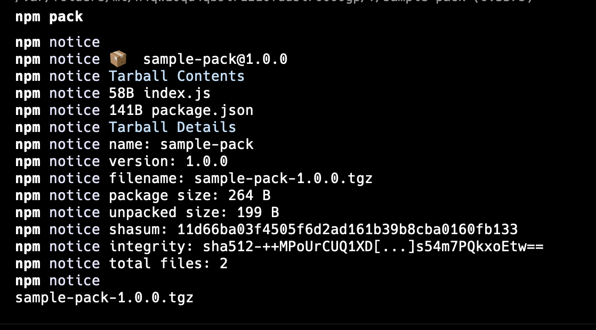
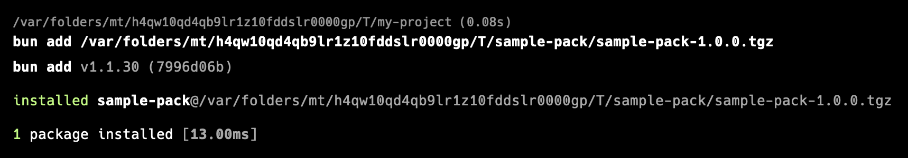
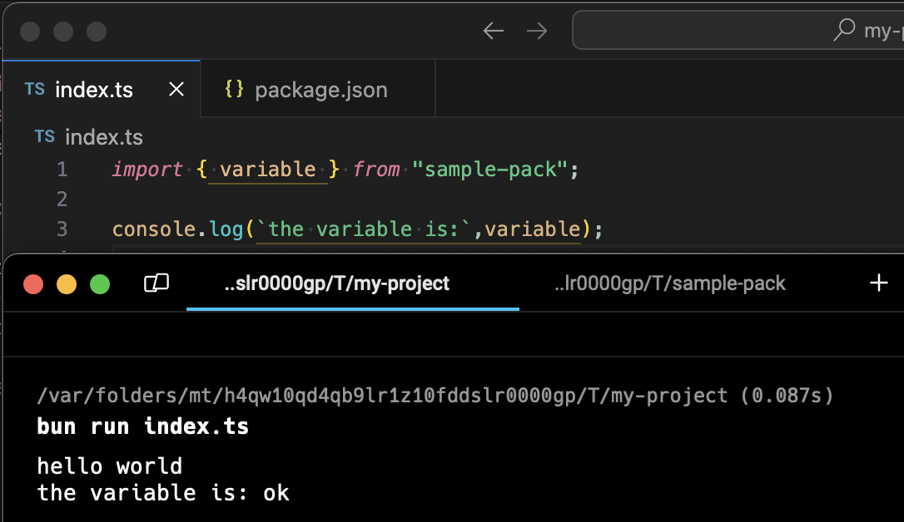
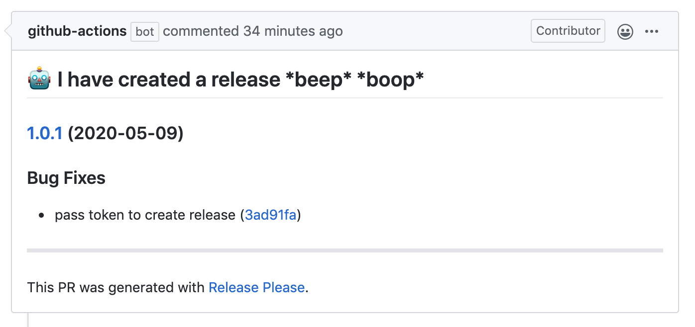

# Nunca mas `npm publish`

Este es el stack perfecto para publicar tus libarías js en [npm](https://www.npmjs.com) sin esfuerzo. Esta guía te quiero presentar una flujo de despliegue para pasar de código alojado en github a [NPM](https://www.npmjs.com).

## Que es NPM

([www.npmjs.com](https://www.npmjs.com)) este es un registry que usan por defecto node.js y bun para descargar dependencias de los proyectos cuando usamo `npm add` o `bun add`. Este registry es gratuito y si queremos compartir codigo entre la comunidad o nuestros proyectos es buena idea alojar este codigo aqui. Si bien permite guardar cualquier tipo de archivo lo normal es guardar archivos escritos en javascript.

Ademoas tengo que mencionar que este sitio tiene una serie de reglas al momento de publicar algun código.

- Cada paquete debe tener a lo menos un archivo `package.json` con una propiedad `title`, `version` y `description`. Tambien es buena idea agregar una propiedad `license`
- Puede ser publicado un paquete privado o publico. Sin embargo de ser privado puede tener tiene un costo que puedes revisar aquí https://www.npmjs.com/products
- Toda actualización a un paquete ya publicado debe estar con una version superior a la previamente publicada
- No se pueden remplazar paquetes ya publicados a no ser que tu seas el dueno de ese paquete
- Todas las verciones deben seguir la convencion semver

Es gracias a estas reglas que nos impide publicar una version mas antigua es que debemos tener en consideración los generadores de versiones, entre los que podemos encontrar [sematic-release](https://github.com/semantic-release/semantic-release) y [release-please](https://github.com/googleapis/release-please). Esta herramienta nos dará un numero de version que podremos usar en nuestro proyecto mas adelante y 100% basado en el historial de commits.

## Paso 1: Crear nuestro token para publicar

El primer antes de publicar nuestro paquete sera el obtener un token para publicar paquetes en npm y para esto podemos optar por 2 caminos:

### Opción 1: Crear token desde la WEB

> Prefiera este método dentro de lo posible.

Vamos a ir al sitio https://www.npmjs.com/settings/jondotsoy/tokens

### Opción 2: Crear token desde la terminal

Ejecuta el comando NPM `npm token create`

## Paso 2: Preparemos el código de nuestro paquete

Bien, ya tenemos el token y ahora debemos pensar en el código que vamos a publicar.

> Aquí te dejo unos concejos de seguridad:
>
> - Si requires configuraciones puedes hacer que tu código lo lea desde las variables de ambientes (`process.env`)
> - No permitas cargar código desde tu librería sin un origen claro.

Debemos pensar bien en quien sera el usuario librería o en otras palabras donde sera ejecutado el código, este puede ser un navegador, un entorno con NodeJS, BunJS o Deno. Si no tenemos claro el entorno podemos siempre asumir que sera un entorno que ejecute soporta javascript [TC39](https://tc39.es/).

Lo mas importante es tener siempre disponible el código JS antes de ser publicado.

## Paso 3: Empaquetar el código

Siempre es buena idea probar el código antes de publicar y para esto _npm_ nos ofrece el comando `npm pack` este nos ayudara a crear un paquete comprimir.



Cuando lo ejecutemos veremos por un lado el resultado del empaquetamiento y un archivo con extension `.tgz`, este archivo nos servirá para probarlos mas tarde.

El command `npm pack` tiene un ciclo de vida que podemos aprovechar para compilar o preparar cualquier archivo si se necesita.

El comando `npm pack` ejecuta en orden los siguientes scripts `prepack`, `prepare` y `postpack`.

```json
{
    ...
    "scripts": {
        "prepack": "Este script es ejecutado previo al empaquetamiento",
        "prepare": "Este script se ejecuta después de prepack y antes de empaqueta",
        "postpack": "Este script se ejecuta después de empaquetamiento (puede ser util para limpiar archivos)"
    }
    ...
}
```

## Puntos de entrada (main y exports)

Nuestro modulo debe tener un identificado un modulo de entrada, este es el script que cargara cuando sea importado por nuestra aplicación, para esto usaremos la propiedad `main` del `package.json`.

```json
{
    ...
    "main": "index.js",
    ...
}
```

```js
require("sample-pack"); // cargara el archivo `node_modules/sample-pack/index.js`
```

Revisa mas a detalle esta propiedad en la documentación de npm https://docs.npmjs.com/cli/v10/configuring-npm/package-json#main

### Multiples puntos de entrada

Nuestro modulo puede tener muchos punto de entradas, estos pueden ser definidos usando la propiedad `exports` del `package.json`, la idea de exportar varios scripts es util si queremos exportar varias utilidades y a su ves disminuir el tamaño del proyecto del cliente final.

```json
{
    ...
    "exports": {
        ".": "./index.js",
        "./feature": "./lib/feature.js"
    }
    ...
}
```

Revisa mas a detalle esta propiedad en la documentación de npm https://docs.npmjs.com/cli/v10/configuring-npm/package-json#exports

## Paso 4 (Opcional): Probar código

Yo realmente te recomiendo probar el paquete antes de seguir, es importante sobre todo para validar que los motores como nodejs puedan leer el paquete bien y si tienes definiciones de typescript también funcionen correctamente. Ademas que no es tan complejo, solo requerimos de un proyecto limpio o con el entorno que necesitamos.

Este script crea un carpeta con un proyecto en bun limpio:

```shell
cd $TMPDIR
mkdir my-project
cd my-project

bun init . -y
```


Ahora necesitamos identificar el archivo tgz del paso 3 y instalar con el comando `bun add .../sample-pack-1.0.0.tgz` (En mi caso uso bun para la prueba pero se puede usar el mismo comando con npm `npm add .../sample-pack-1.0.0.tgz`).



Ahora solo nos hace falta ejecutar nuestras pruebas. Este tipo de pruebas las podemos llamar de integración y tras ejecutar el script `index.ts` podemos ver en la salida el mensaje `hello world` que es ejecutado en el modulo y ver el mensaje `the variable is: ok` que ejecutamos en el script que importa el modulo.



## Paso 5: Automatizar publicación

Ahora que tenemos listo nuestra librería ya podemos publicar en npm, pero para esto lo automatizaremos y para esto vamos a escribir un workflow que nos permita hacer 2 tareas:

- automatiza el versionamiento de la librería. Recordemos que no podemos publicar una libaría en npm sin tener un declara y debe ser superior a la publicada anteriormente
- automatizar la publicación de la librería a npm

El script a continuación es una plantilla que podemos editar a nuestro gusto y esta plantilla tiene dos tareas para crear la version y publicar los cambios en npm cuando estos estén listos.

```yaml
name: Deploy Release

on:
  push:
    branches:
      - main

# Required by release-please to make a PR
permissions:
  contents: write
  pull-requests: write

jobs:
  release-please:
    runs-on: ubuntu-latest
    outputs:
      release_created: ${{ steps.release-please.outputs.release_created }}
    steps:
      - name: release
        id: release-please
        uses: googleapis/release-please-action@v4
        with:
          token: ${{ secrets.GITHUB_TOKEN }}

  # publish on npm
  delivery-npm:
    runs-on: ubuntu-latest
    if: needs.release-please.outputs.release_created
    needs:
      - release-please
    steps:
      - uses: actions/checkout@v4
      - uses: oven-sh/setup-bun@v2
      - uses: actions/setup-node@v4
        with:
          registry-url: "https://registry.npmjs.org"
      - run: bun install
      - run: npm publish
        env:
          NODE_AUTH_TOKEN: ${{ secrets.NPM_TOKEN }}
```

Expliquemos mas a detalles cada paso de la plantilla:

### Secretos

Como puedes ver en este archivo se usa el secreto `NPM_TOKEN`, debemos configurar aquí el token que obtuvimos en el [paso 1](#paso-1-crear-nuestro-token-para-publicar) podemos crear este secreto ya sea desde la consola de github o con el comando `gh secret set NPM_TOKEN`, usemos el que nos sea mas simple.

### Job `release-please`

La tarea `release-please` usa la herramienta [release-please](https://github.com/googleapis/release-please) para observar constantemente la rama `main` y según los commits proponer una nueva version en un PR.



Durante esta etapa ademas podemos automatizar algunos procesos como generar algún otro archivo con la version del package.json. por si nuestro proyecto lo require.

> ℹ️ Si presentan algún problema en esta etapa seria bueno configurar tu proyecto de manera local con el comando `release-please bootstrap`

En la plantilla también podemos ver la variable de salida `release_created` es importante en la siguiente etapa, ya que con ella podemos decidir si publicar o no nuestra variable.

### Job `delivery-npm`

Este job tiene como objetivo el publicar el código de nuestra librería a NPM pero antes valida si la variable `needs.release-please.outputs.release_created` es true. Esto es por que esperamos a que termine de actualizar la version en el paso anterior de otro modo tendríamos un error constantemente por parte de NPM.

Unos errores comunes en este paso es tener un token obsoleto. Podemos repetir el [Paso 1](#paso-1-crear-nuestro-token-para-publicar) y [actualizar en github el secreto](#secretos).

Otro error común es no tener todas las dependencias de nuestra librería, asegúrate de tener todo bien mapeado en el package.json.

## Conclusion

En este artículo, hemos explorado un flujo de trabajo completo para publicar tus librerías JavaScript en npm, desde la creación de un token hasta la automatización del proceso de publicación. Hemos cubierto aspectos cruciales como la preparación del código, el empaquetado, las pruebas y la integración con herramientas de automatización como release-please. Ahora estás equipado con las herramientas y conocimientos necesarios para compartir tus creaciones con la comunidad de desarrolladores y contribuir al ecosistema de npm. ¡Feliz desarrollo!

