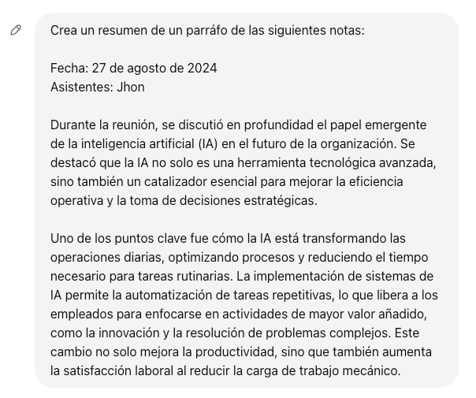

# Primeros pasos para trabajar con RAG

Esta guía es simple, no tiene que ser experto para seguir, intentare guiarte y que completes tu camino al éxito en lo pronto.

Pero buenos comencemos, que es un RAG (en ingles Retrieval-Augmented Generation en español generación aumentada por recuperación)[1] es un mecanismo en donde a nuestro modelo GPT le entregamos mas contexto fuera de la base de entrenamiento que este tenga. pero para entenderlo bien veamos un poco a los modelos actuales. Ya sabemos que son entrenados con millones de registros y mucha base de información de tal manera que si buscamos en algún cliente como ChatGPT podemos pedirle que nos cree una receta de tal plato o que nos liste algunas canciones para relajarnos y esta tarea lo ara basándose en su entrenamiento. Pero si le pedimos que nos cuente como nos fue ayer basado en nuestras notas? o si le pedimos que nos describa algo bien especifico al respecto de nuestros documentos?. En este caso el modelo no sabra respondernos por que no sabe de que estamos hablando o en otras palabras no tiene información para responder a esto. 

En fin para resolver este problema de la falta de conocimiento podemos hacer 2 caminos:

1. re-entrenar nuestro modelo con mas información
2. usar parte de los tokens permitidos por el modelo para entregarle información adicional

El punto numero uno lo vamos a descartar. Simplemente por que sabemos que es un proceso muy lento y que consume mucho recursos. después de todo ya esta tarea lo hizo otras personas y gracias a estas personas tenemos modelos como GPT-4, Llama3.1, Phi 3, Mistral entre otros. 

La segunda opción es mas simple. En la segunda opción veamos ChatGPT para poder explicar como funciona. Usemos el caso de que queremos un resumen de nuestras notas de la reunion. Para ello podemos abrir ChatGPT, y pedirle que resuman las notas de la reunion, tal como se muestra a continuación:

Si nos damos cuenta la primera parte le damos la tarea al modelo "Crea un resumen de un párrafo de las siguientes notas" y ya luego solo le pasamos todo el contexto que nosotros tenemos de la reunion, y este estará limitado solo por el máximo de palabras o tokens permitidos por el modelo que estemos usando, para algunos modelos sera mas que para otros.

En fin ya entendemos como podemos entregarle mas contexto al modelo. Cuando hablamos de RAG hablamos de buscar en una base de datos o archivo gigante esa parte del contexto especifico y que nuestro modelo procese la instrucción basado en ese contexto.

bien ahora nos hace falta el contexto, como obtengo el contexto automático desde un archivo gigante, podría pasarle al modelo como contexto todo el contenido, y eso estaría genial si el modelo no tuviera limites y si son mas archivos? podríamos incluso sumar todo el contenido de todos los archivos y simplemente subir todo el contenido como contexto. pero nuevamente el modelo tiene limites y no es capas de procesar todo el contenido.

Entonces nos hace falta un herramienta mas. Los modelos de incrustación (en ingles Embedding Models), estos son modelos fueron creados pensados en los RAGs. Realmente lo que hace es transformar todo nuestro contexto en un arreglo de vectores todo con el objetivo de servir para almacenarlos en una base de datos y luego poder hacer búsquedas sobre ellas. y tengo que aclarar que no son búsquedas de tipo colación de texto o proximidad de caracteres. si no mas bien búsquedas de proximidad de significado.

[1]: https://aws.amazon.com/es/what-is/retrieval-augmented-generation/