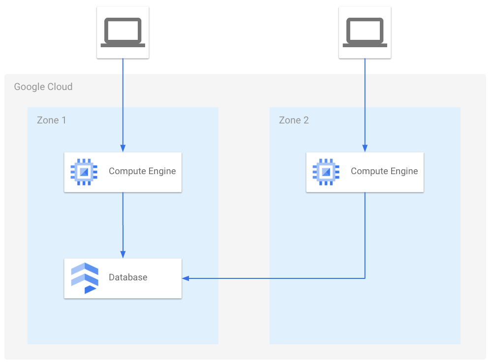

# Primeros Pasos en Google Cloud

## ¿Qué es la nube?

Cuando hablamos de "la nube", nos referimos a tener todos nuestros recursos disponibles en alguna parte del mundo, sin necesidad de saber exactamente dónde están. Esto permite acceder a ellos desde Internet.

Antes de que surgiera el paradigma de la nube, había dos opciones para almacenar y ejecutar aplicaciones: servidores compartidos o reservados. Podíamos arrendar capacidad en un servidor con un conjunto predefinido de herramientas a un precio razonable, lo que se conocía como "hosting". También podíamos tener más independencia instalando nuestro propio servidor con recursos específicos (CPU, RAM, GPU).

## El paradigma de la nube

La nube ofrece la capacidad de acceder a recursos flexibles. Podemos elegir máquinas con CPU y GPU ajustables, cambiar la configuración según nuestras necesidades y incluso usar el equipo solo en momentos específicos.

Justamente debido a esta última característica, se desarrollan dos nuevos patrones de servicios: IaaS (Infrastructure as a Service) y PaaS (Platform as a Service).

## ¿Qué son IaaS y PaaS?

Al entrar a la consola de Google Cloud, nos encontramos con varias API's. Para ejecutar nuestra aplicación lo más rápido posible, tenemos dos opciones:

### Compute Engine (IaaS)

Compute Engine es una infraestructura como servicio (IaaS) que nos ofrece la capacidad de crear nuestras máquinas virtuales y exponerlas a Internet. Esta opción es ideal para tener una aplicación con un entorno muy definido y personalizado.

Con Compute Engine, podemos:

* Crear y configurar nuestras propias máquinas virtuales
* Escalable según nuestras necesidades
* Control total sobre el sistema operativo y la configuración

### App Engine (PaaS)

Mientras que la otra opción es App Engine, una plataforma como servicio (PaaS) que nos permite ejecutar nuestro código bajo demanda. Esta opción es perfecta para enfocarnos solo en el código y no preocuparnos por el sistema operativo.

Con App Engine, podemos:

* Escribir y ejecutar nuestro código sin preocuparnos por la infraestructura subyacente
* Escalable según las necesidades del tráfico de tu aplicación
* No veremos nada de sistema operativo ni configuración

En resumen, Compute Engine es ideal para aplicaciones con un entorno muy definido y personalizado, mientras que App Engine es perfecta para enfocarnos solo en el código y dejar que la plataforma se encargue del resto.

## La Red de Servidores de Google Cloud

La plataforma de Google Cloud cuenta con una red casi universal de granjas de servidores, que puedes ver en detalle en la página [https://cloud.google.com/about/locations](https://cloud.google.com/about/locations). Esta red es fundamental, ya que cada región no solo está conectada a Internet, sino también entre sí mediante cables de fibra óptica que cruzan el planeta, incluso por debajo del mar.

Esta infraestructura permite una velocidad de conexión más rápida si deseas acceder a un servicio alojado en la infraestructura de Google Cloud en otra región. Esto puede ser especialmente útil si quieres ampliar tu aplicación a otra región, pero mantener tu base de datos en otra región para minimizar la latencia posible.

Esta característica de la red de Google Cloud te permite disfrutar de una mayor flexibilidad y escalabilidad al mismo tiempo que mantienes controlado el rendimiento y la latencia en tu aplicación.
