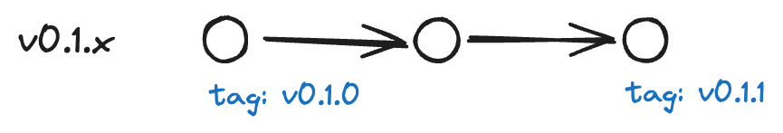
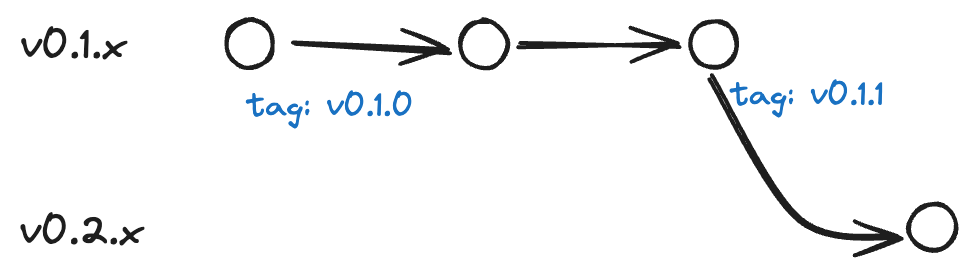
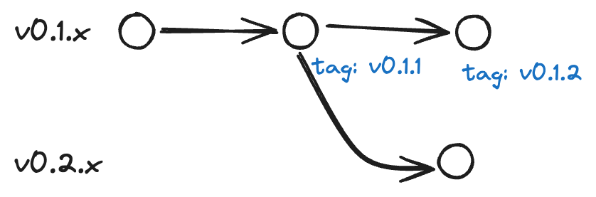

# Desarrollo basado Planificación de Versiones

Normalmente cuando tenemos un proyecto siempre comenzamos con una idea clara el problema a resolver y por eso el primer enfoque suele ser escribir un script rápido para probar la solución y el tamaño del código casi siempre está correlacionado al tamaño del problema. Y si tienes algo más de experiencia surge un nuevo enfoque que llega con la planificación donde se encuentran las etapas; escribir la funcionalidad, planificar y desarrollar.

Y si hablamos de la versión del proyecto, podemos dejárselo a una variable automática como puede ser el hash del código fuente o a una versión autoincremental como puede ser [semver](https://semver.org/) y depender de alguna herramienta que automatize este proceso —en mi caso me gusta mucho [release-please](https://github.com/googleapis/release-please)— si dibujamos un proceso de vería algo así:

```
Idea -> Planificación -> Desarrollo -> Versionamiento -> Publicación
```

En ese flujo versionamiento siempre queda después del desarrollo y como no, si finalmente no es un elemento importante durante el diseño del proyecto.

En esta publicación quiero cambiar un poco ese flujo y dejar el versionamiento durante la etapa de planificación, ya que aquí podemos predecir el futuro y saber que vamos a tener y cuando lo queremos tener.

```
Idea -> Planificación (Con versiones) -> Desarrollo -> Publicación
```

El principal problema que surge al no planificar la versión antes del desarrollo es durante la publicación de nuestro proyecto ya que si tenemos un proyecto con 2 ambientes como pueden ser staging y productivo vamos a ver siguiente comportamiento en staging siempre tendremos todo los desarrollos finalizados y sin mayor problema para nuestro ambiente, pero al momento de mandar los cambios a productivo dependemos de varias conducciones de negocios como por ejemplo si las dependencias están actualizadas para que nuestro producto lo soporte esto siempre nos obliga a reestructurar el código de stating para poder publicar en productivo de manera segura. Bien podemos de igual manera publicar los cambios pero ya que no tenemos en productivo en algunos casos tendremos que modificar las funcionalidades para adaptarlos el nueva definición de nuestras dependencias.

Que tal si planificamos un sistema para gestión de productos, y le asignamos nuestro primer hito el que sera **crear nuevo producto** así que ya tenemos un hito, bueno así de simple ya tenemos nuestra feature, que luego para completar este hito requerimos hacer otras tareas es otro el cuento, pero aquí me quiero concentrar en las características que el cliente final va a ver.

Vamos a crear una tabla para planificar nuestras características. Crearemos una matriz que incluya características, versiones y si son compatibles con esa versión.

| Característica       | V0.1.x |
| :------------------- | :----: |
| Crear nuevo producto |   Si   |

Bien y así de simple ya tenemos nuestra primera matriz y todo antes de comenzar a escribir una linea de código. Ahora quiero que te fijes en algo en la version ves como dice `v0.1.x` esto es por que no nos queremos cerrar a una version absoluta ya que quedara la pregunta: ¿Donde pondremos los fix del sistema o mejoras en el rendimiento? Pues bien a mi personalmente me gusta mas usar el patch de la version para asignar todas mejoras en rendimiento y resolver problemas que puedan haber quedado en esa versión especifica. También sirve para decirle a nuestro clientes que instalen la ultima version disponible desde la v0.1.0 a la v0.2.0.

Y en el tiempo si queremos agregar nuevas características como puede ser **“Desactivar producto”** podemos desde ya planificarlo.

| Característica       | V0.1.x | V0.2.x |
| :------------------- | :----: | :----: |
| Crear nuevo producto |   Si   |   Si   |
| Desactivar producto  |   No   |   Si   |

Esta estrategia no se centra en un solo tipo de proyectos, debería ser usada por todos los proyectos ya que permite transparentar las características entre todos los interesados en el proyecto o interlocutores. Imaginemos que nuestro cliente quiere una funcionalidad para editar el producto, podemos dejar esta característica para una version futura o simplemente no aplicarla, sin embargo con esta estrategia el cliente sabe que puede esperar o no en que version, lo importante es trasparentar que podemos encontrar instalando tal version.

En un proyectos donde disponemos de solo un ambiente digamos productivo podemos decir que tenemos instalado hasta tal version y con eso automáticamente podemos decirle a todos los interlocutores que características están o no disponibles para dicha version.

En esta estrategia, la clave es el orden y la planificación, aunque no este declarada la característica significa que está ya desarrollada o diseñada, solo es la idea la implementación.

## ¿Que pasa si requiero una nueva característica en una version anterior?

Es simple la agregas en la version que deseas, no le tengamos miedo a incrementar el listado, en el ejemplo mas abajo podemos ver como se agregó la característica **“Editar producto”**.

| Característica       | V0.1.x | V0.2.x |
| :------------------- | :----: | :----: |
| Crear nuevo producto |   Si   |   Si   |
| Editar producto      |   Si   |   Si   |
| Desactivar producto  |   No   |   Si   |

Es evidente que esta nueva característica llega después de ya tener planificada la version V0.2.x pero no hay problema, si lo vemos la complejidad para los desarrolladores vemos que solo tienen que agregar en ambas versiones, muchas veces copiando el código o heredando.

## Compatibilidad con GIT

Pongamos manos a la obra, en el desarrollo es normal usar git y podemos usar un sin fin de estrategia pero yo me quedare con la estrategia de [trunk base](https://trunkbaseddevelopment.com/) para este documento, donde tenemos una rama principal con los últimos cambios y simplemente disponemos a nuestro cliente que use la version de la rama principal que mas le guste —Normalmente siempre es el ultimo commit en la historia— Siguiendo con la historia descrita hasta ahora, esto se vería algo así.



Donde tenemos una rama **v0.1.x** que tendremos con las características y varios tag en el tiempo declarando la version que el cliente puede visualizar entendiendo que son versiones funcionales.

## ¿Y la version v0.2.x?

Veamos el escenario mas optimista y asumamos que comenzamos con el desarrollo de la version v0.2.x justo después de terminar toda la version v0.1.x.



Pero bien es normal como ya vimos anteriormente que podemos agregar nuevas características o fix a las versiones anteriores. En ese caso no hay problema en agregar nuevos historias a las ramas anteriores.



Si consideras necesario trasladar esas características a la version v0.2.x no hay problema con unir los cambios.


## No es un framework

Esta estrategia nos obliga a pensar en versiones durante la etapa de diseño y desarrollo. Es muy util para documentar y sobre todo trasparentar un mismo lenguaje entre todos los interlocutores de un proyecto. Hay que ser claro y decir que no es un framework para la gestión de proyectos, pero si es util pensar en como queremos nuestras versiones antes de iniciar con los distintos ciclos de desarrollo del proyecto. Así, se logra entregar más valor al proyecto.

Destacar los valores deseados y visualizar qué características requieren más esfuerzo por parte del equipo de desarrollo es fundamental. Es común asignar esfuerzos basados en la novedad en lugar de las necesidades de la siguiente versión.
